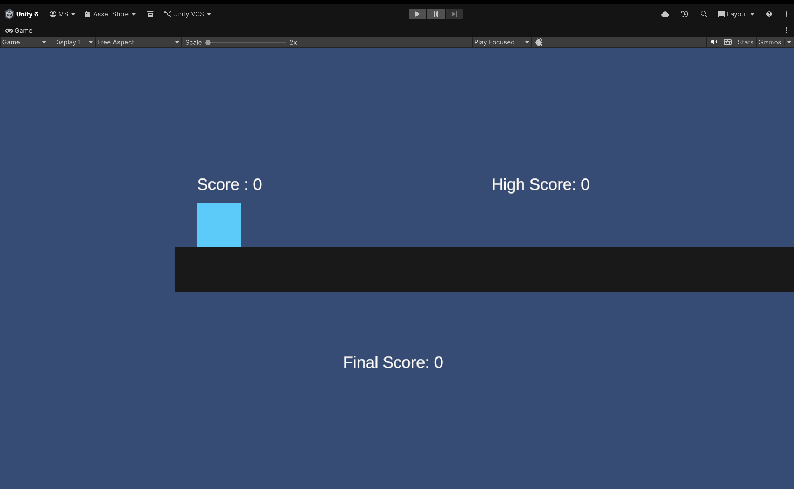
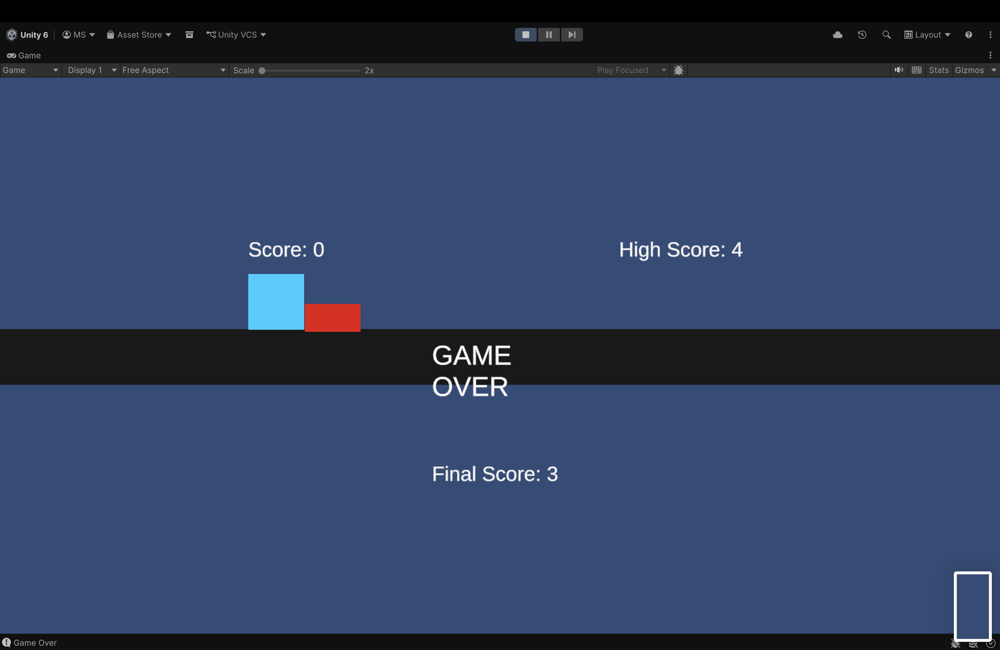

# 🏃 Endless Runner Game (Unity)

An **Endless Runner** game built using Unity where the player continuously runs forward and must avoid obstacles to survive as long as possible.

## 🎮 Features

-  Endless gameplay  
-  Procedural obstacle spawning  
-  Increasing game speed over time  
-  Live score tracking  
-  High score saving using PlayerPrefs  
-  Game Over system with final score display  

## How to Play

- Press **Space / Tap** to jump  
- Avoid obstacles  
- Survive as long as possible to increase your score  

##  Game Mechanics

- The player automatically moves forward  
- Obstacles spawn at intervals  
- Game speed gradually increases  
- Score increases over time  
- Game ends on collision with obstacle  

##  UI Elements

- **Score** → Displays current score during gameplay  
- **High Score** → Shows highest score achieved  
- **Game Over Panel**:
  - Final Score  
  - High Score  
  - Game Over message  

## Built With

- Unity (2D)  
- C#  
- TextMeshPro (UI)  

## Setup Instructions

1. Clone the repository  
2. Open in Unity Hub  
3. Open the main scene  
4. Press ▶ Play  

## Future Improvements

- Restart button  
- Sound effects & music  
- Better animations  
- Mobile controls optimization  
- Difficulty scaling  

## Screenshots

## Gamplay

## UI

## 👨‍💻 Author

Developed as part of a **Game Development Challenge**

